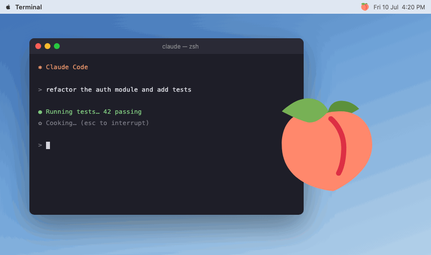

# bootytap 🍑

[](https://github.com/lazizbekravshanov/bootytap/actions/workflows/ci.yml)

A light, affectionate tap for your vibe-coding agent — the loving inversion of [OpenWhip](https://github.com/GitFrog1111/OpenWhip).



One hotkey: a gentle peach-tap animation plays over your screen, and a little praise —
`good bot, keep vibing <3` — is typed into your focused Claude Code session, where it
arrives as a real message. Claude genuinely receives the love.

Silent. Click-through. Never steals focus.

## Install

```bash
npm install -g github:lazizbekravshanov/bootytap
bootytap
```

A peach appears in your menu bar / system tray. That's it.

<details>
<summary>Or run from source</summary>

```bash
git clone https://github.com/lazizbekravshanov/bootytap.git
cd bootytap
npm install
npm start   # run it
npm link    # optional: global `bootytap` command
```

</details>

## Use

| Action | How |
|---|---|
| Tap 🍑 | Click the peach, or press `⌃⌥⇧B` (Control+Option+Shift+B) |
| Tap from the terminal | Run `bootytap` again while it's already running |
| Animation only, no typing | Right-click the peach → untick **Type praise** |
| Quit | Right-click the peach → **Quit bootytap** |

If the hotkey is taken by another app, bootytap falls back to `⌃⌥⇧P` — the tray menu shows the active one. (Control+Option+Shift is used because terminals grab most Command+Shift combos for their own menus.)

## Use from Claude (MCP)

bootytap ships an MCP server, so Claude can be tapped from inside a conversation — no
hotkey, no focus games. Register it once for Claude Code:

```bash
claude mcp add -s user bootytap bootytap-mcp
```

New sessions get a `tap` tool: say "tap" mid-task (or let Claude celebrate on its own)
and the peach animation plays on your screen while the praise arrives in-chat through
the protocol. Any other MCP client can use it too — the command is just `bootytap-mcp`
(stdio).

The praise line + Enter goes to **whatever window has focus**, so focus your Claude Code
terminal first — and mind that Enter submits anything already half-typed there. bootytap
doesn't start at login yet; add it to your OS's login items if you want it always running.

## Platform notes

- **macOS** — praise typing needs Accessibility permission:
  System Settings → Privacy & Security → Accessibility → enable bootytap (may be listed as Electron).
  The animation works without it.
- **Windows** (beta) — types via PowerShell SendKeys. CI-tested, not yet human-tested.
- **Linux** (beta) — needs [`xdotool`](https://github.com/jordansissel/xdotool) for typing and a compositor for the overlay.

## Credits

Inspired by [OpenWhip](https://github.com/GitFrog1111/OpenWhip) — the whip; this is the pat.
Peach, hand & heart art: [Twemoji](https://github.com/jdecked/twemoji), [CC-BY 4.0](https://creativecommons.org/licenses/by/4.0/).

MIT. Be kind to your robots.
